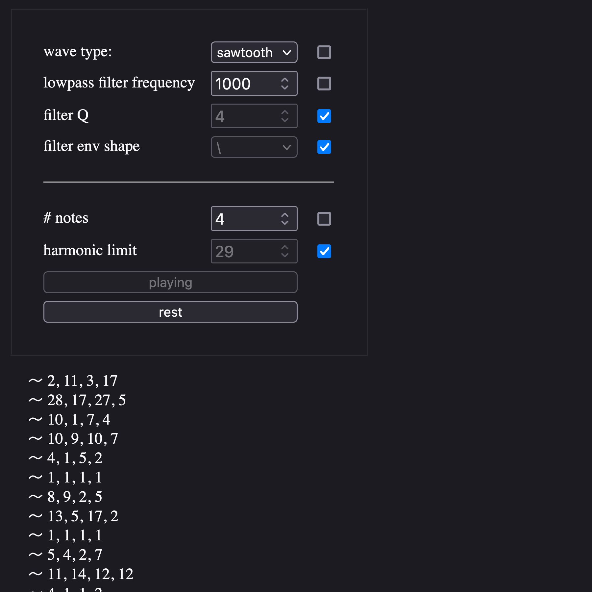

## Links

[Live Demo](https://parkerdavis1.github.io/harmonic-clouds/)

## Screenshot

## Desciption

A simple web application written in vanilla Javascript using the Web Audio API. It plays a series of randomly generated [just intonation](https://en.wikipedia.org/wiki/Just_intonation) chords, specifically notes from the [harmonic series](<https://en.wikipedia.org/wiki/Harmonic_series_(music)>).

The notes fade in and out, the notes of each chord staggered and panned. There are no effects such as reverb or delay. There is a single lowpass filter with an envelope on each oscillator.

The result is that of a harmonic wave. I find it surprisingly beautiful and meditative, especially considering the minimal materials: a few browser oscillators, filters, and envelopes.

The interface allows you to choose the wave type, lowpass filter frequency, filter Q, filter envelope shape, the number of notes for each chord, and the "harmonic limit" (how high up in the harmonic series notes will be chosen from).

The checkboxes next to each input randomize that specific parameter for each chord.

The "Rest" button will stop the generation of new chords but will let the current chord finish its iteration.
